# 外呼系统（WAHU）

名单、任务、坐席工作台、模拟外呼、通话记录与录音、CRM 回写、合规与报表，外加 AI 机器人外呼。
技术栈与 `D:\crm` / `D:\erp` / `D:\codex` 同构：FastAPI + SQLAlchemy Core（sqlite 默认 / postgres 可选）
+ Vite + React + TypeScript + Tailwind。

默认 **零外部依赖离线可跑**：sqlite + 内置假 CRM + 模拟线路 + stub 大模型。
真实线路、真实 ASR/TTS、真实 CRM 都是可插拔适配器。

## 能力一览

| 模块 | 说明 |
| --- | --- |
| 账号与权限 | 自带账号 + 三角色（管理员 / 主管 / 坐席），行级可见性：坐席看自己、主管看本团队、管理员全量 |
| 名单管理 | 从 CRM 拉取（线索 / 联系人）或导入 CSV / XLSX；号码归一化、校验、批内与库内去重、逐行导入报告 |
| 外呼任务 | 指派 / 领取 / 退回 / 跳过、优先级、拨打时段、最大重呼次数，未接自动回池 |
| 坐席工作台 | 取下一个、客户资料卡、话术提示、点击拨号、通话状态机、挂断后必填结果与意向 |
| 通话记录 | 状态事件流（拨号 → 振铃 → 接通 / 无人接听 / 占线 / 关机 / 空号）、时长、结果、录音占位（可播放的静音 WAV） |
| CRM 回写 | 结束后追加 `activities(kind=call)` + `notes` + `tasks`，带 `Idempotency-Key`，失败进队列重试，全程审计 |
| 合规 | 黑名单（号码 / 客户）、免打扰时段、每日与每号码拨打上限、号码脱敏、全量审计 |
| 报表 | 概览、坐席排行、按日趋势、结果与意向分布、任务进度、合规拦截量 |
| 实时推送 | SSE 事件流，按身份过滤，坐席工作台实时看到通话状态 |
| AI 机器人（二期） | 话术脚本、并发自动外呼、规则 + LLM 应答、意向分级、转人工回流坐席队列 |

## 界面预览

截图来自本机实跑：`sqlite` + 内置假 CRM + 模拟线路，管理员视角，1440x900。
按 `python -X utf8 scripts/seed_demo.py` 灌演示数据后复现。

### 登录

自带账号体系（管理员 / 主管 / 坐席三角色），登录页直接显示当前运行模式，一眼看出接的是假数据还是真实系统。

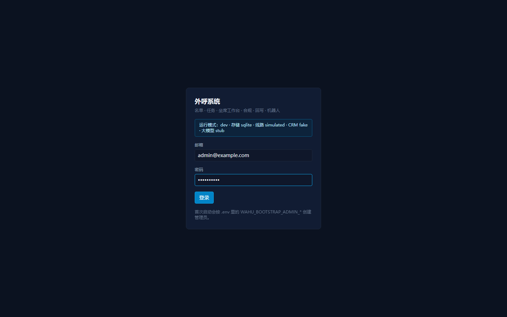

### 坐席工作台

外呼的主入口：**手动拨号盘**（不用名单直接打任意号码）+ 名单任务队列 + 通话状态 + 合规提示。
右侧「线路」卡片实时显示当前是模拟线路还是真实线路。

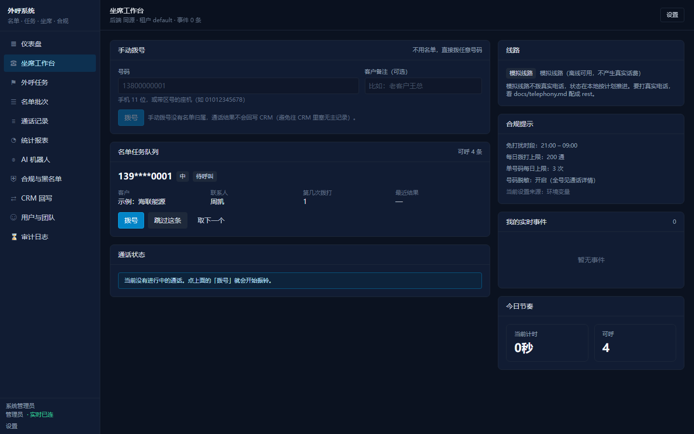

拨号后走状态机并实时推送：拨号中 → 振铃中 → 接通 / 无人接听 / 占线 / 关机 / 空号，
右侧事件流是 SSE 推过来的：

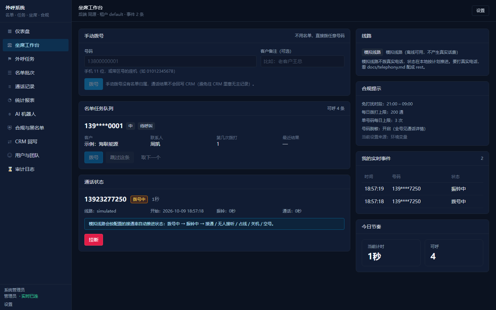

### 外呼任务

指派 / 领取 / 退回 / 暂停 / 完成，带进度条与最大重呼次数；未接通的号码按冷却时间自动回池。

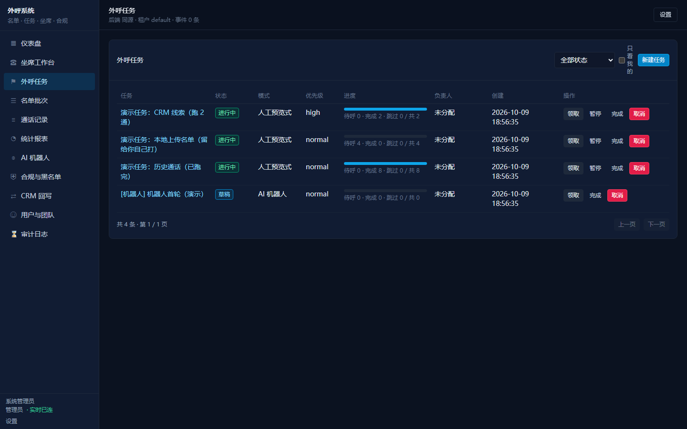

### 名单批次

从 CRM 拉取或上传 CSV / XLSX，逐行导入报告（入库 / 重复 / 失败原因）。列表一律脱敏。

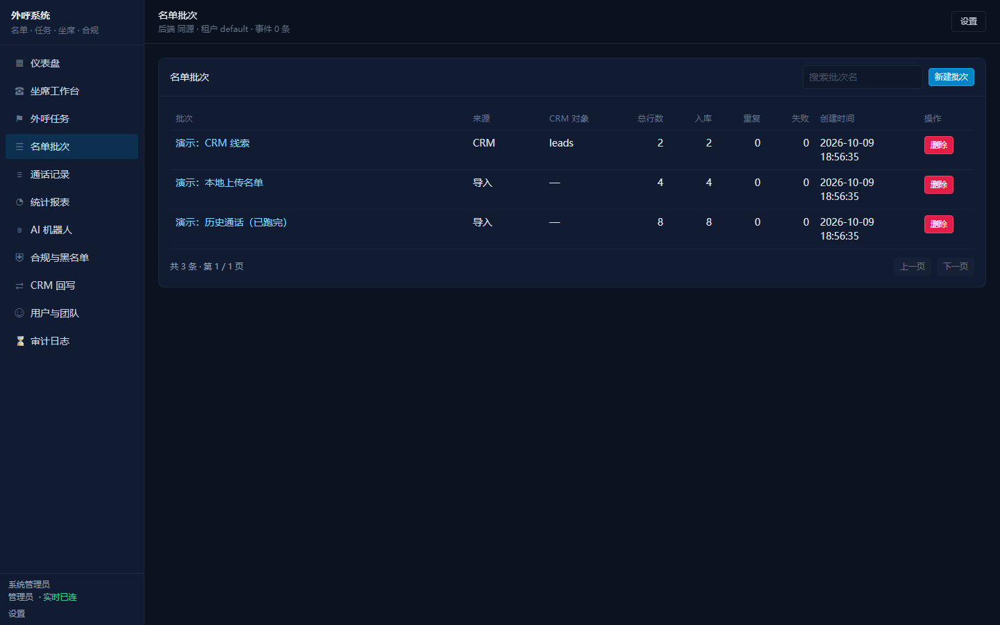

### 通话记录

结果、意向、时长、振铃、坐席、录音；支持按状态 / 接通情况 / 意向 / 日期筛选，点开看事件流与录音。

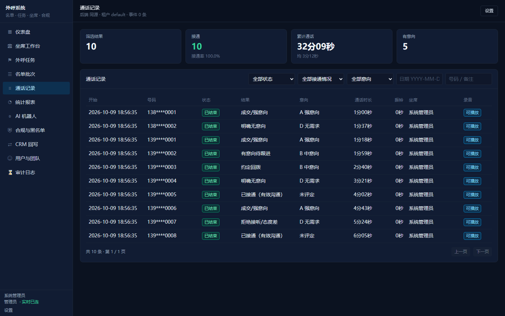

### 统计报表

拨打 / 接通率 / 通话时长 / 意向，按日趋势、坐席排行、结果与意向分布、任务进度。

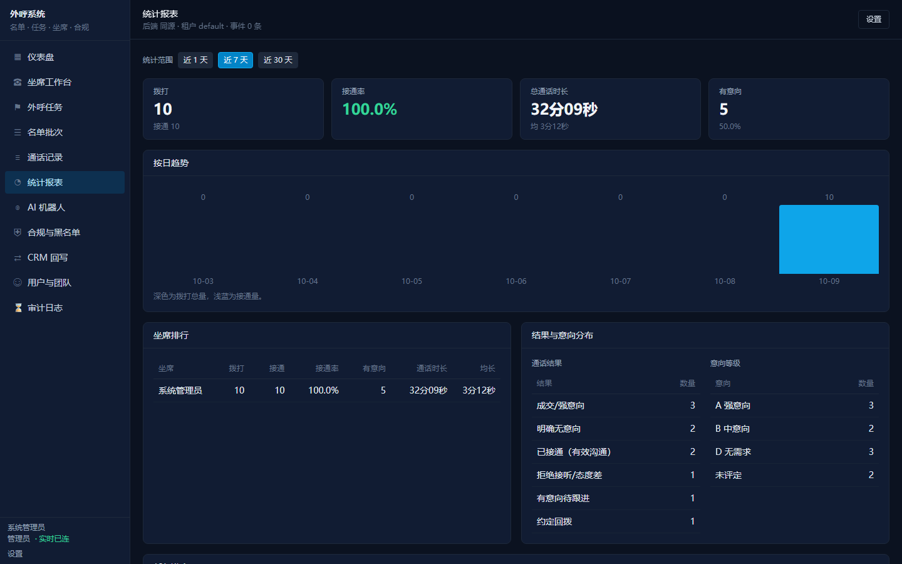

### AI 机器人

话术脚本 + 并发自动外呼 + 意向分级 + 转人工回流坐席队列。语音层是模拟的：由你「扮演客户」输入文字验证对话流。

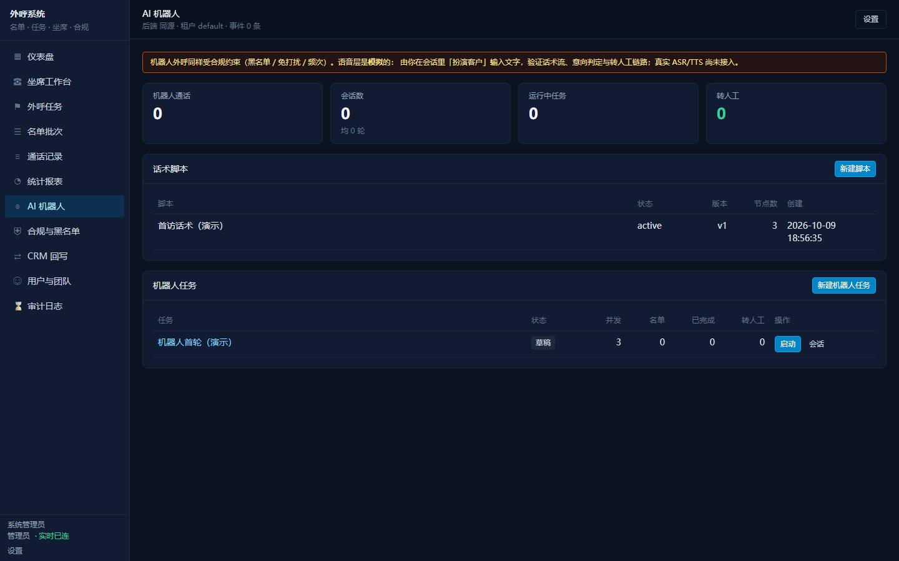

### 合规与黑名单

黑名单（号码 / 客户维度）、免打扰时段、每日与单号码频次上限、号码脱敏开关，改完立即生效。

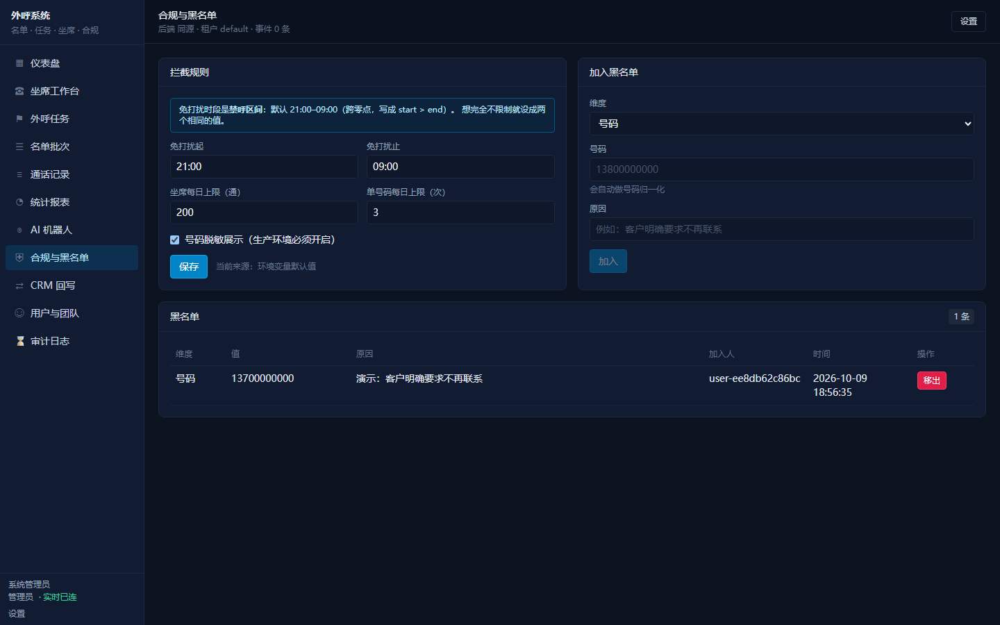

### CRM 回写

只追加 activities / notes / tasks 并带幂等键；名单没有 CRM 归属时明确标 `skipped` 并写清原因，而不是悄悄丢掉。

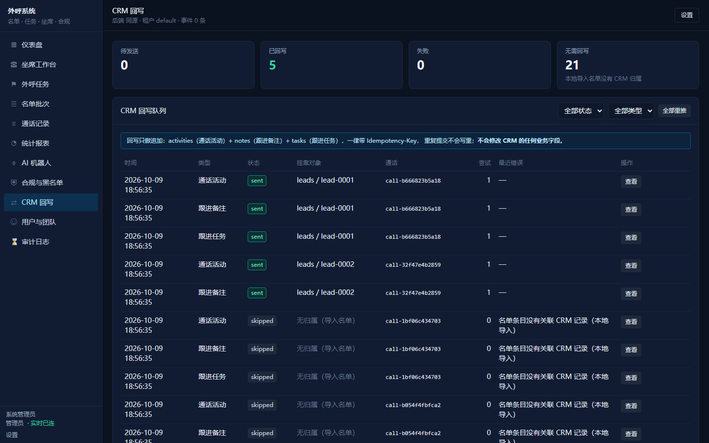

### 用户与团队

三角色与团队管理，行级可见性：坐席看自己、主管看本团队、管理员全量。

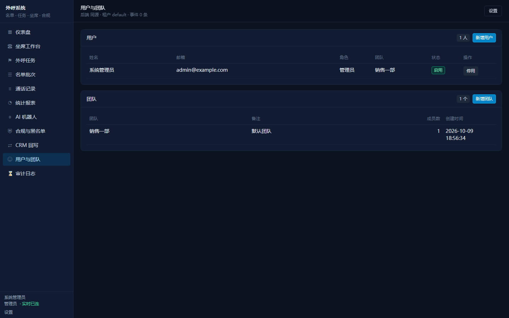

### 审计日志

拨号、挂断、提交结果、合规拦截、看全号、回写重推…… 全量留痕，管理员可查全部。

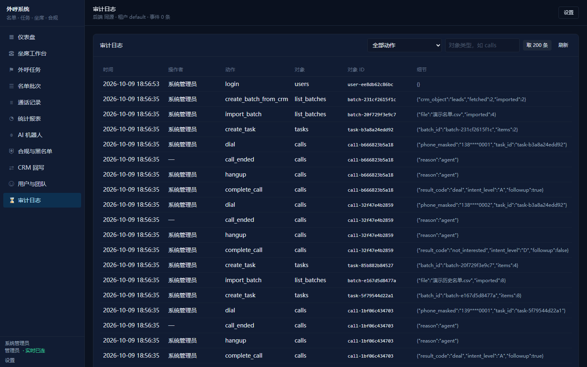

### 仪表盘

概览数字 + 我的待办 + 运行状态（任务、回写、合规拦截）+ 实时事件。

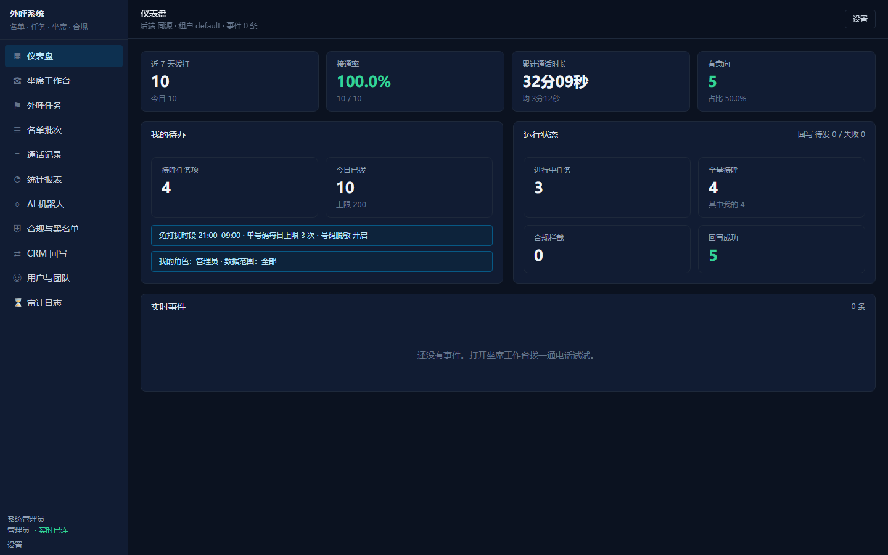

### 设置

接口地址、身份令牌、改密码，以及**电话线路**的当前状态（模拟 / 真实、网关是否配全、回调地址）。

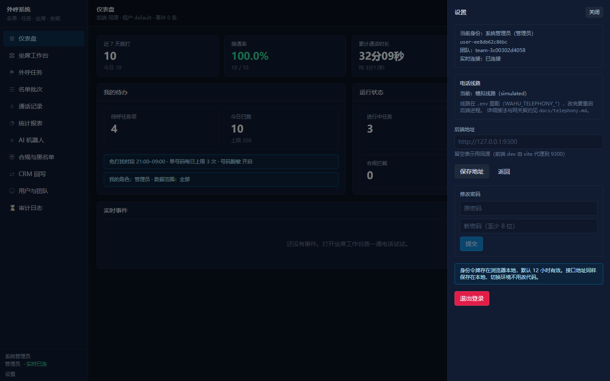

## 快速开始

```powershell
cd D:\waihu_system
pip install -r requirements.txt
copy .env.example .env

# 后端（默认端口 9300，同时托管 web/dist）
python -X utf8 -m uvicorn app.main:app --host 127.0.0.1 --port 9300

# 前端开发服务器（5176，代理到 9300）
cd web
npm install
npm run dev
```

首次启动会自动建表并创建管理员（`WAHU_BOOTSTRAP_ADMIN_EMAIL` / `..._PASSWORD`，默认 `admin@example.com` / `admin12345`）。
浏览器打开 http://localhost:5176 ，用管理员登录。

想一键看到完整界面（名单 / 任务 / 通话 / 回写 / 机器人）：

```powershell
python -X utf8 scripts/seed_demo.py
```

## 对接自研 CRM

```powershell
# 1) 起 CRM（另一个仓库）
cd D:\crm
python -X utf8 -m uvicorn app.main:app --host 127.0.0.1 --port 9100

# 2) 先只读探测契约，确认对象与号码字段没问题
cd D:\waihu_system
python -X utf8 scripts/crm_probe.py
```

然后把 `.env` 改成：

```
WAHU_CRM_MODE=rest
WAHU_CRM_BASE_URL=http://127.0.0.1:9100/api/v1
WAHU_CRM_API_TOKEN=dev-service-token      # 必须与 D:\crm 的 CRM_SERVICE_TOKEN 一致
```

重启进程生效（`.env` 只在进程启动时读一次）。回写只追加 activities / notes / tasks，**不会改 CRM 的任何业务字段**。

## 打真实电话

默认是**模拟线路**（离线可跑、不产生话费）。要打真实电话，在 `.env` 里切到真实线路：

```ini
WAHU_TELEPHONY_PROVIDER=rest
WAHU_TELEPHONY_BASE_URL=http://127.0.0.1:9400   # 线路网关地址
WAHU_TELEPHONY_TOKEN=dev-line-token
WAHU_TELEPHONY_AGENT_PHONE=13800000000          # 双呼：先呼坐席这个号
```

系统只跟线路网关打三个接口（呼叫 / 挂断 / 状态回调），网关负责对接厂商 API 或 SIP 中继。
**代码只是三件事里的一件**：线路账号与主叫号码资质要你自己去办。
接法、契约与厂商字段对照见 `docs/telephony.md`。

用云通信账号（阿里云为例）：

```powershell
# 干跑：把将要发给阿里云的请求打出来（不发真请求）
python -X utf8 scripts/aliyun_voice_gateway.py --print-request --param CalledShowNumber=0571xxxx --param TtsCode=TTS_xxxx --param CalledNumber={phone}

# 上真账号：AccessKey 只从环境变量读
$env:ALIYUN_ACCESS_KEY_ID='LTAI...'
$env:ALIYUN_ACCESS_KEY_SECRET='...'
python -X utf8 scripts/aliyun_voice_gateway.py --live --param CalledShowNumber=0571xxxx --param TtsCode=TTS_xxxx --param CalledNumber={phone}
```

注意产品线别买错：**机器人外呼**用语音通知类（`SingleCallByTone`），
**人工坐席真实通话**必须用云呼叫中心类产品。详见 `docs/telephony.md`。

本机想先跑通整条链路（不需要任何账号）：

```powershell
python -X utf8 scripts/fake_telephony_gateway.py --port 9400   # 一个窗口：假线路网关
python -X utf8 -m uvicorn app.main:app --port 9300             # 另一个窗口：系统（rest 模式）
python -X utf8 scripts/check_real_line.py                      # 第三个窗口：验收整条链路
```

## 验证

```powershell
cd D:\waihu_system
python -X utf8 -m unittest discover -s tests -t .   # 139 条，全离线
python -X utf8 -m compileall -q app tests scripts

cd web
npx tsc --noEmit
npm run build
```

已实测通过：139 条 unittest；真实 CRM（`WAHU_CRM_MODE=rest`，CRM 起在 9100）拉名单 →
模拟外呼 → 在 CRM 里看到新增的 activities / notes / tasks。
**未验证**：`Dockerfile` 与 `docker-compose.yml`（本机没有 docker，只作交付物，不声明已验证）；
真实线路、真实 ASR/TTS 都没有接入（适配器只留接口）。

## 目录结构

```
app/
  core/           配置、日志、时钟、口令与令牌、号码工具
  adapters/       sqlite / postgres 存储适配器与全部表元数据
  api/            HTTP 路由、依赖注入、SSE
  services/       身份、名单、任务、通话、合规、回写、报表、机器人
  telephony/      线路适配器（simulated / rest 占位）
  integrations/   自研 CRM 网关（fake / rest）
  robot/          话术脚本引擎、大模型客户端、模拟语音
web/              Vite + React + TS + Tailwind 控制台
sql/001_init.sql  Postgres DDL
scripts/          演示数据、CRM 契约探测、链路自检
tests/            unittest
docs/             运行手册与接口说明
```

## 端口

| 服务 | 端口 |
| --- | --- |
| 外呼系统 API | 9300 |
| 外呼系统前端 dev | 5176 |
| 自研 CRM | 9100 |
| 自研 ERP | 9200 |
| AI 能力层 | 8000 |